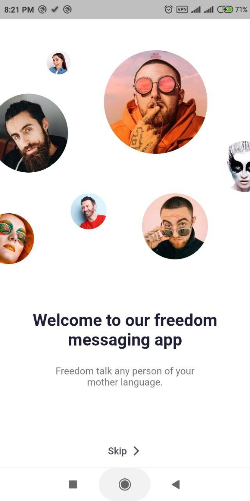
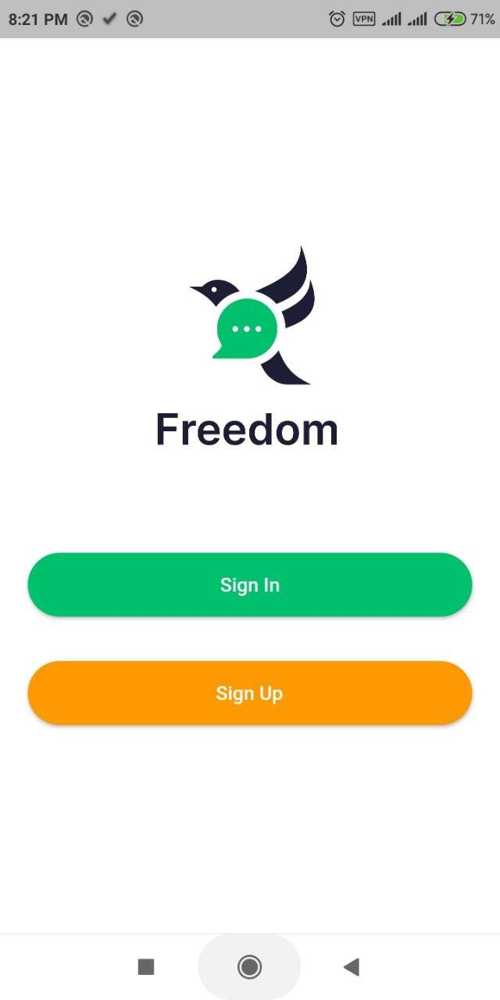
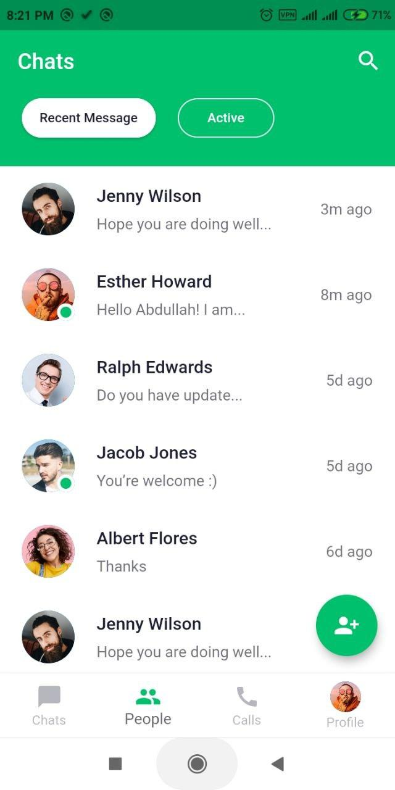

# Chat/Messaging App Light and Dark Theme - Flutter

> Building a messing/chat app **UI** using **Flutter** that runs both Android and iOS devices also has a dark and light theme. We create in total 4 screens all of that support both Dark Theme and Light Theme. At first, we design a welcome screen that contains an image with a tag line also has a skip button. Once the user press, its transfers to the Sign-in or Sign-up screen. The last two screens are the main screen, Chats screens it shows the list of people you are chated with. At the end message screen which support text message, audio message, and video messages.


## Demo Screenshots

| Welcome | Sign-in Signup | Home | Chat |
| :---: | :---: | :---: | :---: |
|  |  |  |  |

## Try & Demo

Run:

```bash
$ git clone https://github.com/BaseMax/Flutter-Chat-Messaging-App-Theme
$ cd Flutter-Chat-Messaging-App-Theme
$ flutter run
```

Check tools:

```bash
$ flutter doctor -v
$ flutter packages get
$ flutter pub get
```

Build:

```bash
$ flutter build apk
```

## Sources

What sources I did get help from:

- http://www.androidcoding.in/2020/09/12/flutter-google-fonts/
- https://pub.dev/packages/google_fonts/example
- https://stackoverflow.com/questions/59446354/the-google-fonts-package-in-flutter-app-is-not-working
- https://api.flutter.dev/flutter/material/InkWell-class.html
- https://pub.dev/packages/google_fonts
- https://www.geeksforgeeks.org/flutter-using-google-fonts/
- https://pub.dev/documentation/google_fonts/latest/google_fonts/GoogleFonts-class.html

### Acknowledgment

I saw an [Youtube video](https://www.youtube.com/watch?v=uiJF-ShOLyo) and It's encouraged me to repeat this project myself.

**P.S:** All of images not designed or prepared by me. They are for Abu Anwar. Thanks.

© Copyright Max Base
