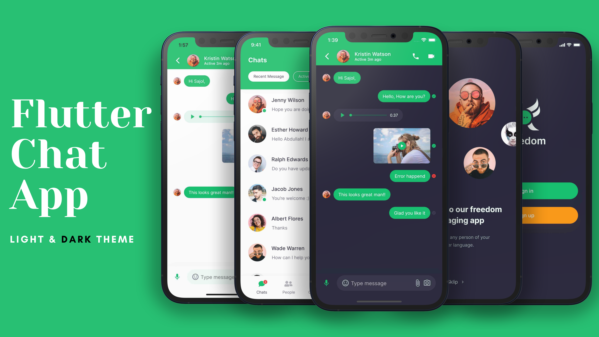

# Chat/Messaging App Light and Dark Theme - Flutter

> Building a messing/chat app **UI** using **Flutter** that runs both Android and iOS devices also has a dark and light theme. We create in total 4 screens all of that support both Dark Theme and Light Theme. At first, we design a welcome screen that contains an image with a tag line also has a skip button. Once the user press, its transfers to the Sign-in or Sign-up screen. The last two screens are the main screen, Chats screens it shows the list of people you are chated with. At the end message screen which support text message, audio message, and video messages.



## Demo Screenshots

| Welcome | Sign-in Signup | Home | Chat |
| :---: | :---: | :---: | :---: |
|  |  |  |  |

## Try & Demo

Run:

```bash
$ git clone https://github.com/BaseMax/Flutter-Chat-Messaging-App-Theme
$ cd Flutter-Chat-Messaging-App-Theme
$ flutter run
```

Check tools:

```bash
$ flutter doctor -v
$ flutter devices
$ flutter pub get
$ flutter packages get
```

Build:

```bash
$ flutter build apk
```

## Sources

What sources I did get help from:

- http://www.androidcoding.in/2020/09/12/flutter-google-fonts/
- https://pub.dev/packages/google_fonts/example
- https://stackoverflow.com/questions/59446354/the-google-fonts-package-in-flutter-app-is-not-working
- https://api.flutter.dev/flutter/material/InkWell-class.html
- https://pub.dev/packages/google_fonts
- https://www.geeksforgeeks.org/flutter-using-google-fonts/
- https://pub.dev/documentation/google_fonts/latest/google_fonts/GoogleFonts-class.html


What I learn by doing or repeat this project?

- How to use Google fonts?
- Where is Flutter project config file?
- How components and screens files works in flutter?
- How detect Phone dark mode enabled or no?
- How control theme style?
- How share some config or global variable between all of components and screens?
- etc...

So do not be afraid to repeat something.

Even if it sounds ridiculous, it helps you gain new experience and learn new things.
And this is great.

### Flutter methods/functions

```dart
AppBar
AspectRatio
AssetImage
Body
BorderSide
BottomNavigationBarItem
BottomNavigationBarThemeData
BoxDecoration
Center
CircleAvatar
Color
Column
Container
FloatingActionButton
Icon
IconThemeData
InputDecoration
Offset
Padding
RoundedRectangleBorder
Row
SafeArea
Stack
Text
TextButton
TextField
TextStyle
ThemeData
```

### How I extract function or Flutter element names?

Manualy search in all of project files via your IDE/editor with `:(\s*|)([a-zA-Z]+)\(` regex query.

Or get names by running a PHP script:

```php
<?php
$data = file_get_contents("all-files-code.txt");
preg_match_all('/:(\s*|)([a-zA-Z]+)\(/i', $data, $matches);
// print_r($matches[2]);
foreach($matches[2] as $func) {
	print $func . "\n";
}
?>
```

Remove duplicate lines and Sort function names Alphabetical with https://www.textfixer.com/tools/remove-duplicate-lines.php online service.

### Acknowledgment

I saw an [Youtube video](https://www.youtube.com/watch?v=uiJF-ShOLyo) and It's encouraged me to repeat this project myself.

**P.S:** All of images not designed or prepared by me. They are for Abu Anwar. Thanks.

© Copyright Max Base
